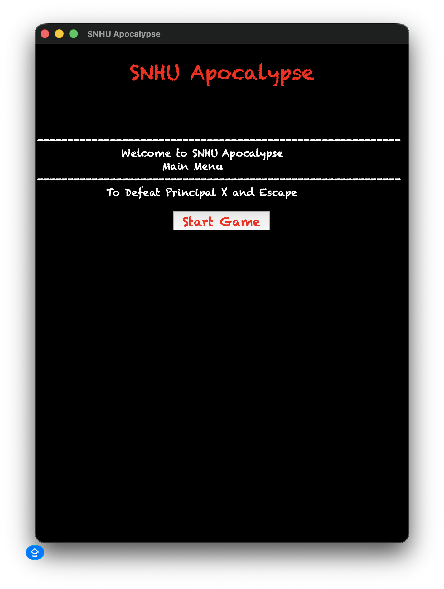
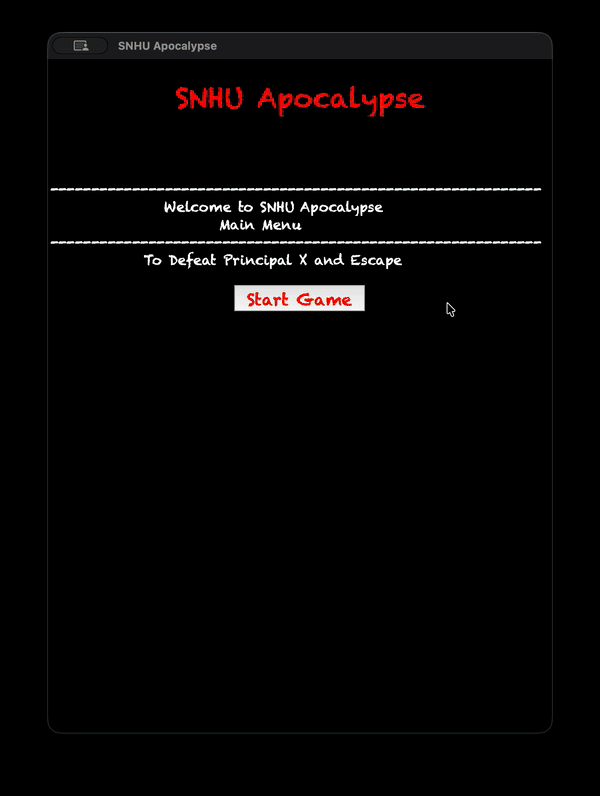

# 🧟 SNHU Apocalypse - Text Adventure Game

## 🎮 Description
Navigate through an abandoned school, collect 6 items, and defeat Principal X to escape.
Do you have what it takes to survive the SNHU Apocalypse?

## 📁 Original Artifact
The original version is on the [`main`](https://github.com/JWiggins973/text-adventure-python.git) branch.

## ⚡ Enhancements - Software Design and Engineering
- Refactored code into `Room`, `Player`, and `Game` classes
- Added Tkinter GUI with room images, navigation buttons, and item pickup
- Custom room images generated with AI (Gemini)
- Input validation and defensive programming throughout
- Organized source files into the `snhu_apocalypse` Python package
- Added `.gitignore` to exclude system and cache files from version control
- Added `requirements.txt` documenting project dependencies
- Added unit tests across `Room`, `Player`, and `Game` covering movement, inventory, win/lose, and reset

## 📸 Preview

<table>
  <tr>
    <td align="center"><b>Main Menu</b></td>
    <td align="center"><b>Gameplay</b></td>
  </tr>
  <tr>
    <td></td>
    <td></td>
  </tr>
</table>

## ▶️ How to Run
Run the following command in your terminal:

    python3.12 main.py

## 🧪 Running Tests
Run the following command from the project root:

    python3 -m unittest

## ✍️ Author
**Jermaine Wiggins** | Southern New Hampshire University | CS 499 Capstone
